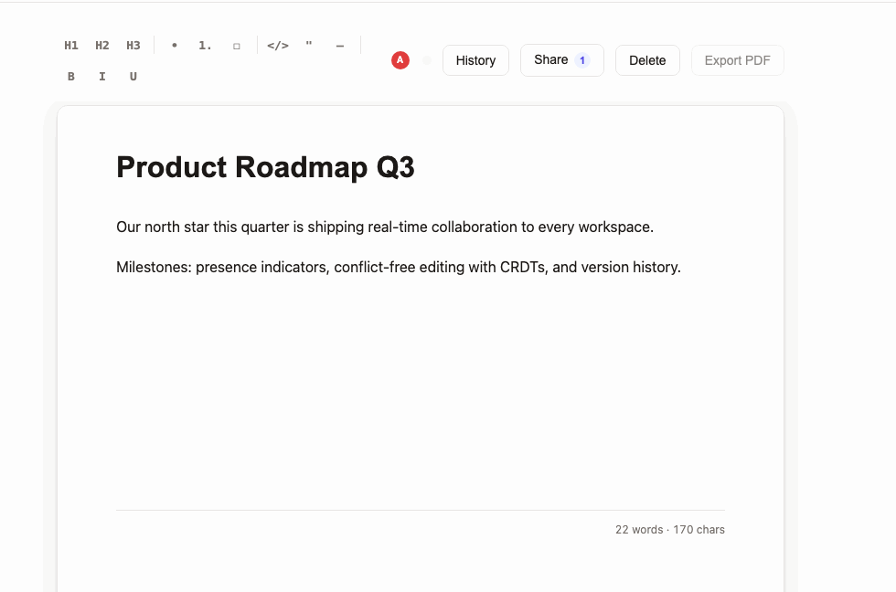
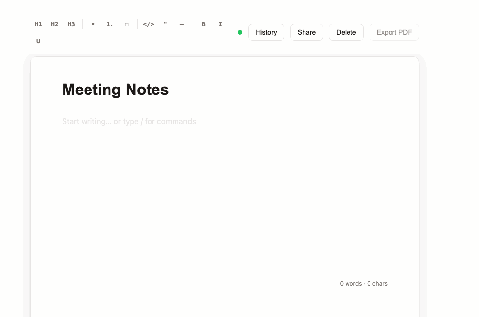
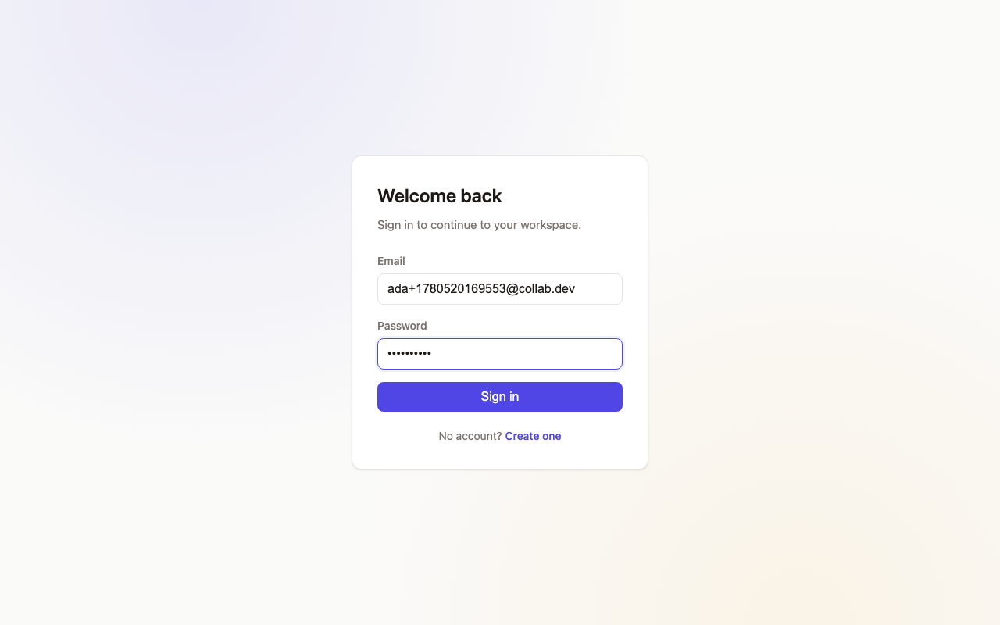
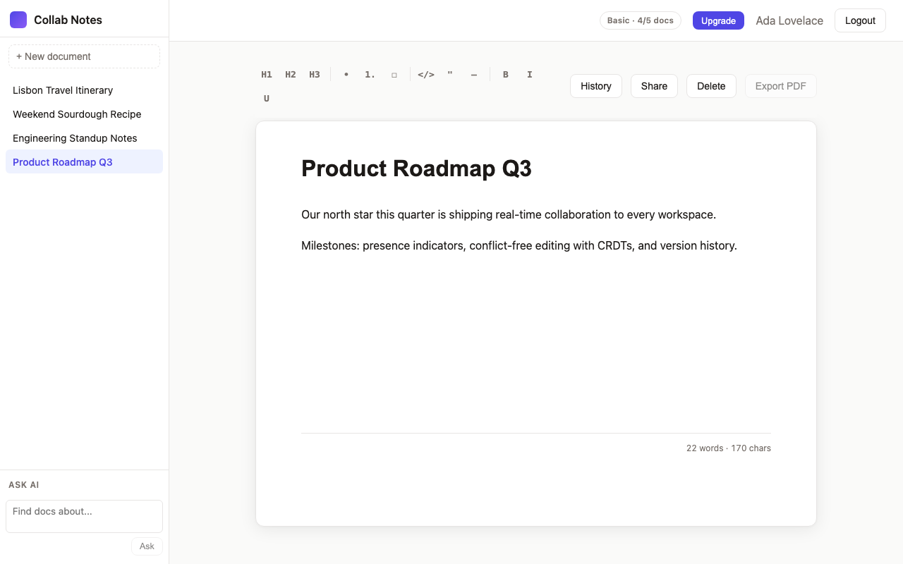
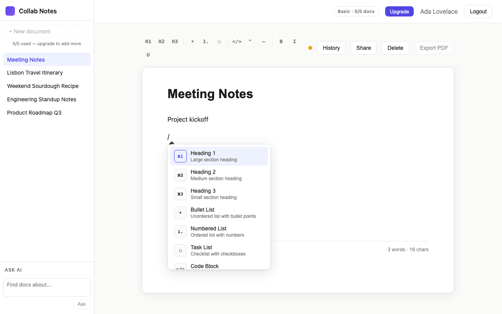
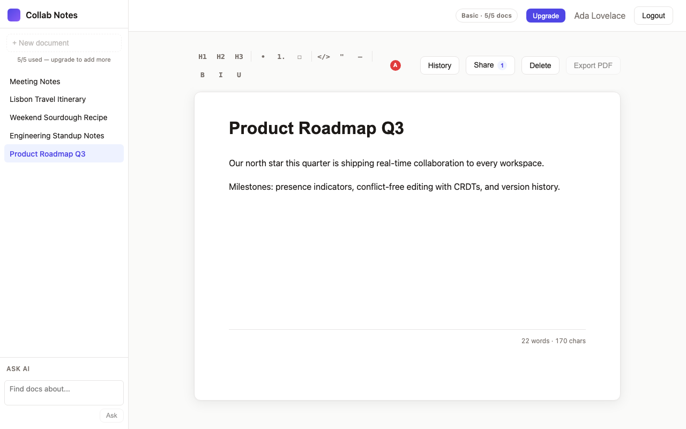
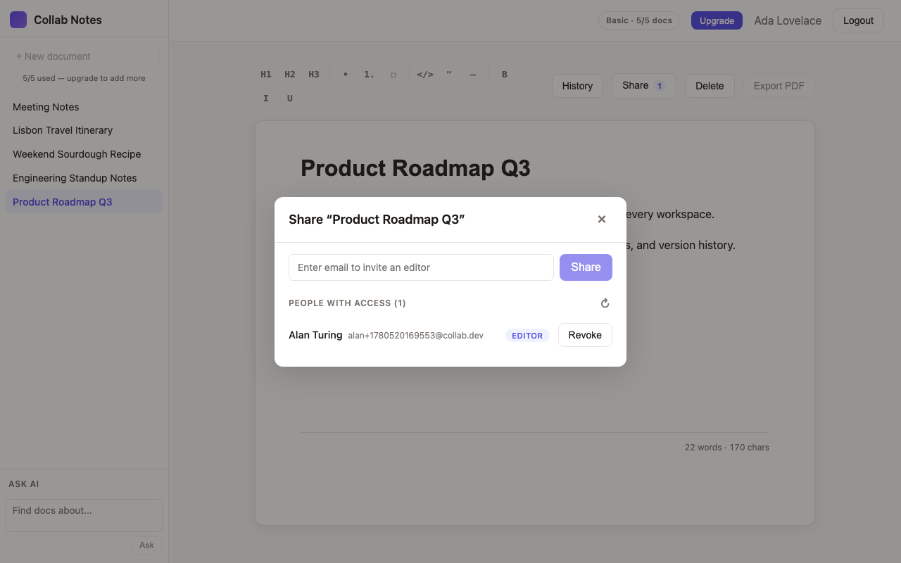
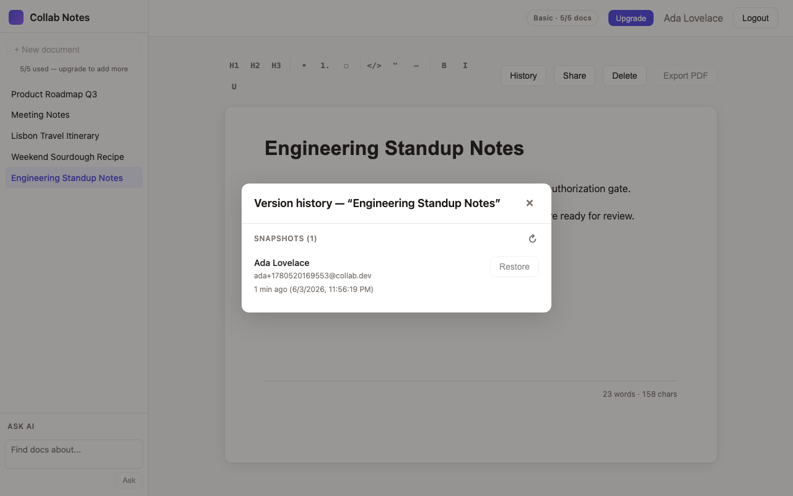
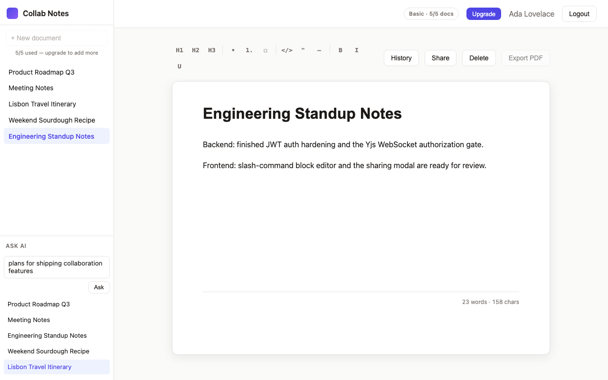

# Collab Notes

> A real-time, Notion-inspired collaborative note-taking app — block editor,
> live multi-user presence, conflict-free CRDT sync, version history, sharing,
> and fully-local AI document search.


## Demo

**Real-time collaboration** — two people editing the same document live, with
presence indicators. No refresh, no save button, no merge conflicts (CRDTs).



**Slash-command block editor** — type `/` to insert headings, lists, task
lists, code blocks, quotes and more, Notion-style.



## What is Collab Notes

Collab Notes is a full-stack collaborative editor. Each document is a live
CRDT shared between everyone with access: edits merge automatically, presence
shows who else is in the room, and the whole thing keeps working offline and
across tabs. A local embedding model powers semantic search over your notes
without sending anything to a third-party API.

Key features:

- **Real-time collaboration** — Yjs + a custom y-websocket server keep every
  open copy of a document in sync, conflict-free, character by character.
- **Live presence** — colored avatars show who else is editing; revoking a
  collaborator kicks them out of the document instantly.
- **Block editor** — Tiptap with a `/` slash menu (headings, bullet / numbered
  / task lists, code blocks with syntax highlighting, blockquotes, dividers)
  and a formatting toolbar.
- **Sharing** — invite an editor by email, see who has access, and revoke it.
- **Version history** — snapshots are captured on logout and browsable
  read-only per document.
- **Trash & restore** — soft delete with a trash section, restore, or delete
  permanently.
- **Ask AI (local, no external API)** — semantic search over your documents
  using `transformers.js` + the bundled `all-MiniLM-L6-v2` model. The same
  search is also exposed over the **Model Context Protocol (MCP)** so an
  external client (e.g. Claude Desktop) can query your notes.
- **Plans & limits** — Basic and Premium tiers with document and sharing caps
  enforced on both the client and the server.
- **Secure by default** — JWT auth (bcrypt password hashing) and **authorized
  WebSocket connections** (a valid token + document access is required before
  joining a CRDT room).
- **Auto-save & cross-tab sync** — debounced persistence plus a
  `BroadcastChannel` that keeps every tab's sidebar consistent.

## Screenshots

| | |
| --- | --- |
| **Sign in** — JWT auth | **Workspace** — sidebar, editor, plan badge |
|  |  |
| **Slash menu** — block insertion | **Real-time presence** — a second editor joins |
|  |  |
| **Sharing** — invite editors by email | **Version history** — read-only snapshots |
|  |  |
| **Ask AI** — semantic search over your notes | |
|  | |

## Tech stack

| Area | Technologies |
| ---- | ------------ |
| **Frontend** | React 18, Vite, TypeScript, React Router, Tiptap (block editor) |
| **Real-time** | Yjs (CRDT), y-websocket, a custom WebSocket sync server, Awareness presence, `BroadcastChannel` |
| **Backend** | Node.js 20, Express, TypeScript (strict), Zod validation |
| **Database** | SQLite via Prisma (swappable for Postgres with one line) |
| **Auth & security** | JWT (`jsonwebtoken`), bcrypt, authorized WebSocket upgrades |
| **AI** | `transformers.js` + `all-MiniLM-L6-v2` embeddings (runs locally), `@modelcontextprotocol/sdk` |
| **Tooling** | npm workspaces monorepo, Vitest + Supertest + Testing Library |
| **Containers** | Docker + docker-compose (api / yws / nginx-served client) |

In development the client proxies `/api/*` to the server, so API calls come
from the same origin in the browser. The Yjs WebSocket server listens on its
own port.

```
collab-notes/
├── client/   # Vite + React app (port 5173)
└── server/   # Express API (port 4000) + Yjs WS server (port 4001)
```

## Getting started

**Requirements:** Node.js 20+, npm 10+ (Docker optional).

Install dependencies once at the repo root:

```bash
npm install
```

Run the full dev stack (client + API + yws together):

```bash
npm run dev
```

- Client: <http://localhost:5173>
- API: <http://localhost:4000>
- Yjs WebSocket: <ws://localhost:4001>

### Run individually

```bash
npm run dev:server    # API on :4000
npm run dev:yws       # Yjs WebSocket on :4001
npm run dev:client    # Vite dev server on :5173
```

### Production build

```bash
npm run build
```

### Tests

```bash
npm run test          # server + client (312 tests)
npm run typecheck     # both workspaces
```

## Run with Docker

The full stack ships as three containers behind `docker compose`:

| Service | Image source        | Port (host:container) | Purpose                          |
| ------- | ------------------- | --------------------- | -------------------------------- |
| api     | `server/Dockerfile` | `4000:4000`           | Express REST API + Prisma migrate |
| yws     | `server/Dockerfile` | `4001:4001`           | Yjs WebSocket sync server        |
| client  | `client/Dockerfile` | `5173:80`             | nginx serving the built SPA      |

**One-time setup**

```bash
cp .env.example .env
# edit .env and set JWT_SECRET (use: openssl rand -base64 48)
```

**Start the stack**

```bash
docker compose up --build
```

Then open <http://localhost:5173>. nginx reverse-proxies `/api/*` to the
`api` container; the client connects to `ws://localhost:4001` for real-time
sync.

**Data persistence**

The SQLite database lives in the named volume `api_data` mounted at
`/data` inside the api container. `docker compose down` keeps the volume;
`docker compose down -v` wipes it.

**Migrations**

`prisma migrate deploy` runs automatically on every `api` container
startup — idempotent, so it's a no-op when the DB is already current.

## Plans & limits

Every account is on one of two plans. The caps are enforced on the server
(the source of truth) and mirrored in the UI so buttons disable before you
hit a wall.

| Plan | Active owned documents | Editors per document | Upgrade |
| ---- | ---------------------- | -------------------- | ------- |
| **Basic** (default) | 5 | 1 | `POST /api/auth/upgrade` (or the **Upgrade** button) |
| **Premium** | Unlimited | Unlimited | — |

The plan badge in the workspace header shows the current tier and live usage
(e.g. `Basic · 4/5 docs`).

## API endpoints

All endpoints are JSON. Auth-required ones expect
`Authorization: Bearer <token>`.

### Auth — `server/src/auth/routes.ts`

| Method | Path                  | Auth | Notes                                                                |
| ------ | --------------------- | ---- | -------------------------------------------------------------------- |
| POST   | `/api/auth/register`  | —    | Body: `{ email, password, name? }` → `{ token, user }`               |
| POST   | `/api/auth/login`     | —    | Body: `{ email, password }` → `{ token, user }`                      |
| GET    | `/api/auth/me`        | ✓    | Current user (includes `plan`)                                       |
| POST   | `/api/auth/upgrade`   | ✓    | Switch the caller's plan to `premium`; returns refreshed user        |

### Documents — `server/src/documents/routes.ts`

| Method | Path                                       | Auth | Notes                                                          |
| ------ | ------------------------------------------ | ---- | -------------------------------------------------------------- |
| GET    | `/api/documents`                           | ✓    | Owned + shared (active), each with `permission`                |
| GET    | `/api/documents/trash`                     | ✓    | Owner-only soft-deleted list                                   |
| POST   | `/api/documents`                           | ✓    | Create — basic plan capped at 5 active owned docs              |
| POST   | `/api/documents/snapshot-mine`             | ✓    | Logout-time version snapshot                                   |
| GET    | `/api/documents/:id`                       | ✓    | Owner OR shared editor                                         |
| PATCH  | `/api/documents/:id`                       | ✓    | Update title / content (owner OR editor)                       |
| GET    | `/api/documents/:id/versions`              | ✓    | Read-only version history                                      |
| DELETE | `/api/documents/:id`                       | ✓    | Soft delete (owner-only); returns `{ affectedUserIds }`        |
| DELETE | `/api/documents/:id/permanent`             | ✓    | Permanent delete (owner-only)                                  |
| PATCH  | `/api/documents/:id/restore`               | ✓    | Restore from trash (owner-only)                                |
| GET    | `/api/documents/:id/shares`                | ✓    | List shares (owner-only)                                       |
| POST   | `/api/documents/:id/share`                 | ✓    | Body: `{ email }` — basic plan capped at 1 share per doc       |
| DELETE | `/api/documents/:id/share/:userId`         | ✓    | Revoke (owner-only)                                            |

### AI — `server/src/ai/router.ts`

| Method | Path           | Auth | Notes                                                                   |
| ------ | -------------- | ---- | ----------------------------------------------------------------------- |
| POST   | `/api/ai/ask`  | ✓    | Body: `{ query, limit? }` → `{ results: [{id, title, similarity}] }`    |

### Misc

| Method | Path           | Auth | Notes                              |
| ------ | -------------- | ---- | ---------------------------------- |
| GET    | `/api/health`  | —    | `{ status: "ok" }`                 |
| GET    | `/api/ping`    | —    | `{ message: "pong", time }`        |

## Real-time channels

- **Yjs WebSocket** (`ws://localhost:4001`, or `/yws` on the unified server) —
  per-document rooms named `doc-<id>`. Carries CRDT updates (title + content)
  and awareness (presence, revoke signals). Connections are authorized (valid
  JWT + document access) before joining a room.
- **BroadcastChannel** (`collab-notes-doc-events`) — same-browser cross-tab
  sidebar/event sync (created / soft-deleted / restored / permanent-deleted /
  share-added / share-revoked / shared-doc-* / etc.). Filtered by
  `forUserId`.

## Documentation

- `documentation.txt` — feature-by-feature walkthrough, architecture diagram,
  test coverage, design notes.
- `future_improvements.txt` — explicit roadmap of known gaps and scaling
  considerations.
